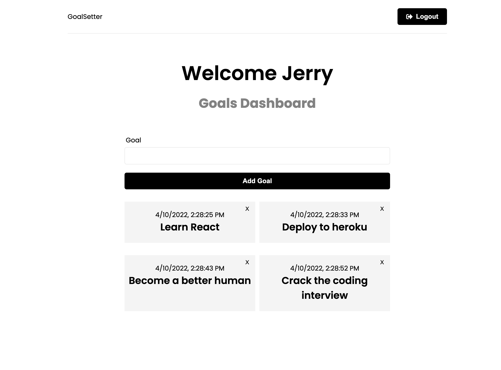

# Goalsetter Web App

Built this while learning about React and the MERN stack

## Table of contents

- [Overview](#overview)
  - [Screenshot](#screenshot)
  - [Links](#links)
- [My process](#my-process)
  - [Built with](#built-with)
  - [What I learned](#what-i-learned)
  - [Continued development](#continued-development)
  - [Useful resources](#useful-resources)
- [Author](#author)
- [Acknowledgments](#acknowledgments)

## Overview

### Screenshot



### Links

- API Documentation: [https://documenter.getpostman.com/view/18051440/UVyysCHv](https://documenter.getpostman.com/view/18051440/UVyysCHv)
- Repository URL: [https://github.com/jeramiahgcoffey/goalsetter](https://github.com/jeramiahgcoffey/goalsetter)
- Live Site URL: [https://goalsetter-9fad.onrender.com/](https://goalsetter-9fad.onrender.com/) - Free Server, please be patient while spinning up

## My process

### Built with

- [React](https://reactjs.org/) - JS library
- [Redux.js](https://redux.js.org/) - State management
- [Redux Toolkit](https://redux-toolkit.js.org/) - Toolset for Redux
- [Express.js](https://expressjs.com/) - Web-framework for Node.js
- [Mongoose](https://mongoosejs.com/) - MongoDB object modeling for Node.js
- [JWT](https://jwt.io/) - JSON Web Tokens
- Semantic HTML5 markup
- Mobile-first workflow
- Flexbox

### What I learned

Developing this application with help from Traversy media helped me to learn so much about the MERN stack, REST APIs, MongoDB, state management with Redux, functional React components, and deployment with Heroku.

I learned about using Axios to make HTTP requests from the frontend

```js
const createGoal = async (goalData, token) => {
  const config = {
    headers: {
      Authorization: `Bearer ${token}`,
    },
  };

  const response = await axios.post(API_URL, goalData, config);

  return response.data;
};
```

Learned about thunk functions to handle asynchronous requests

```js
// Get user goals
export const getGoals = createAsyncThunk(
  'goals/getAll',
  async (_, thunkAPI) => {
    try {
      const token = thunkAPI.getState().auth.user.token;
      return await goalService.getGoals(token);
    } catch (error) {
      const message =
        (error.response &&
          error.response.data &&
          error.response.data.message) ||
        error.message ||
        error.toString();
      return thunkAPI.rejectWithValue(message);
    }
  }
);
```

And using slices with extra reducers to update the global state

```js
export const goalSlice = createSlice({
    name: 'goal',
    initialState,
    reducers: {
        reset: (state) => initialState,
    },
    extraReducers: (builder) => {
        builder
            .addCase(createGoal.pending, (state) => {
                state.isLoading = true;
            })
            .addCase(createGoal.fulfilled, (state, action) => {
                state.isLoading = false;
                state.isSuccess = true;
                state.goals.push(action.payload.goal);
            })
            .addCase(createGoal.rejected, (state, action) => {
                state.isLoading = false;
                state.isError = true;
                state.message = action.payload;
            })
```

I also learned a lot about creating a backend, modeling your data, and setting up routes for the API

Built schemas using mongoose

```js
const userSchema = mongoose.Schema(
  {
    name: {
      type: String,
      required: [true, 'Please add a name'],
    },
    email: {
      type: String,
      required: [true, 'Please add an email'],
      unique: true,
    },
    password: {
      type: String,
      required: [true, 'Please add a password'],
    },
  },
  {
    timestamps: true,
  }
);
```

Used express router to handle requests to API endpoints

```js
router.post('/', registerUser);
router.post('/login', loginUser);
router.get('/me', protect, getMe);
```

And built controllers for each endpoint

```js
// @desc    Register new user
// @route   POST /api/users
// @access  Public
const registerUser = asyncHandler(async (req, res) => {
  const { name, email, password } = req.body;

  if (!name || !email || !password) {
    res.status(400);
    throw new Error('Please add all fields');
  }

  // Check if user exists in db
  const userExists = await User.findOne({ email });

  if (userExists) {
    res.status(400);
    throw new Error('User already exists');
  }

  // Hash password
  const salt = await bcrypt.genSalt(10);
  const hashedPassword = await bcrypt.hash(password, salt);

  // Create user in db
  const user = await User.create({ name, email, password: hashedPassword });

  if (user) {
    res.status(201).json({
      _id: user.id,
      name: user.name,
      email: user.email,
      token: generateToken(user._id),
    });
  } else {
    res.status(400);
    throw new Error('Invalid user data');
  }
});
```

I enjoyed learning about middleware for overwriting the deafult error handler, but more importantly, to handle authentication and authorization for protected routes (JSON Web Tokens)

```js
const protect = asyncHandler(async (req, res, next) => {
  let token;

  if (
    req.headers.authorization &&
    req.headers.authorization.startsWith('Bearer')
  ) {
    try {
      // Get token from header
      token = req.headers.authorization.split(' ')[1];

      // Verify token
      const decoded = jwt.verify(token, process.env.JWT_SECRET);

      // Get user from token
      req.user = await User.findById(decoded.id).select('-password');

      next();
    } catch (error) {
      console.log(error);
      res.status(401);
      throw new Error('Not authorized');
    }
  }

  if (!token) {
    res.status(401);
    throw new Error('Not Authorized, no token');
  }
});
```

### Continued development

Moving forward, I am very excited to start using this stack and development approach for future projects of all sizes. I realize I have much to learn, but I have a much better understanding of the process and architecture. I want to continue focusing on the MVC structure, Express as a backend framework, React and all the many things it has to offer, and different ways of managing state.

I found Redux to be overwhelming and overly complicated. I will continue practicing using the technology, and also begin exploring alternatives such as Context API.

### Useful resources

- [Traversy Media](https://www.traversymedia.com/) - Brad is hands down the best teacher for all things web dev. I have learned so much because of this man. He deserves so much credit!
- [React Docs](https://reactjs.org/docs/getting-started.html) - The documentation for React is very well designed and maintained. I highly recommend coming here first for all questions regarding the library.

## Author

- Website - [Jeramiah Coffey](https://github.com/jeramiahgcoffey)

## Acknowledgments

A huge thanks to Brad Traversy and his YouTube channel. I would not be where I am in my journey of learning to be a developer if it wasn't for him and his content. Thanks!

- [Brad's Github](https://github.com/bradtraversy)
